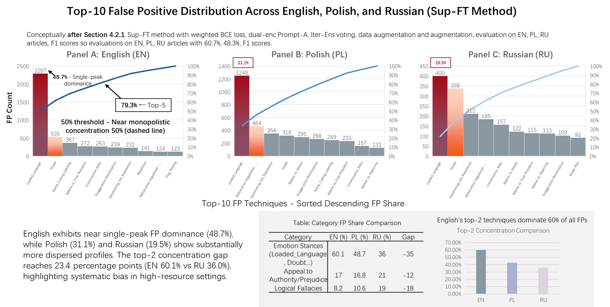
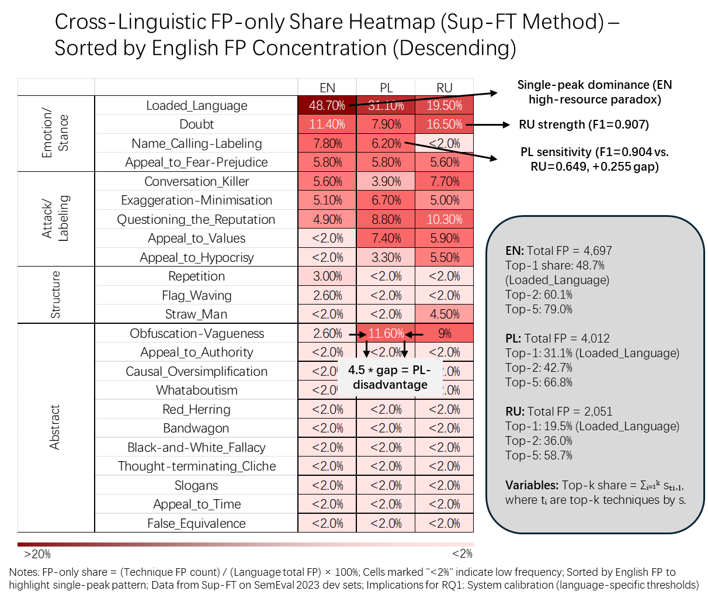
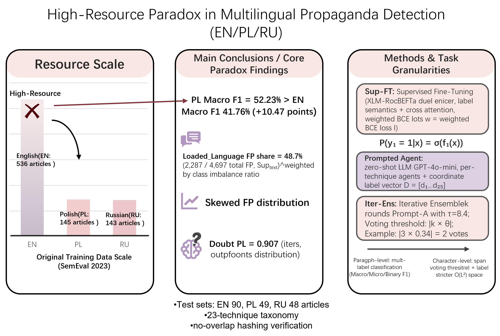

# Appendix W. Additional Error-Structure Figures for Cross-Linguistic FP Concentration (Sup-FT)

This appendix provides supplementary visual diagnostics for **false-positive (FP) concentration** under the **Supervised Fine-Tuning (Sup-FT)** method across **English (EN)**, **Polish (PL)**, and **Russian (RU)**. These figures support the paper’s “high-resource paradox” finding: despite English having the largest original training split, its errors are **structurally skewed**—with FP mass disproportionately dominated by a single high-salience technique (**Loaded_Language**), indicating systematic over-triggering on emotional/stance cues and suggesting boundary/threshold instability rather than mere model capacity limitations. fileciteturn2file3 fileciteturn2file9

## W.1 FP-only share: calibration definition used in all figures

To quantify how concentrated false positives are in each language, we use **FP-only share** (a concentration diagnostic). For a technique *t*:

\[
\mathrm{Share}_t = \frac{\mathrm{FP}_t}{\sum_k \mathrm{FP}_k}\times 100\%,
\]

where the denominator is the **total FP count** for a given language under a fixed method setting (here: Sup-FT). This definition is intentionally *calibration-oriented* and is **not** directly comparable to percentages that use alternative denominators (e.g., TP+FP). fileciteturn2file8

---

## Figure W.1 — Top-10 false positive distributions across EN/PL/RU (Sup-FT)

**What this figure shows.** For each language, the bars display the **Top-10 techniques** ranked by FP count (span-level), and the cumulative curve indicates how quickly FP mass accumulates. English approaches a **single-peak regime**: **Loaded_Language contributes 48.7%** of English total FPs (2,287 / 4,697). In comparison, Polish and Russian show more dispersed profiles, with top-1 FP shares of **31.1%** (PL) and **19.5%** (RU). fileciteturn2file9 fileciteturn2file12

**Interpretation (link to main claims).** The strong English peak suggests systematic **over-triggering on emotion/stance cues**, consistent with “boundary looseness” in multi-label calibration. This aligns with the paper’s claim that **data composition and calibration** can outweigh raw annotation scale in multilingual settings. fileciteturn2file3 fileciteturn2file9

---

## Figure W.2 — Cross-linguistic FP-only share heatmap (Sup-FT), sorted by English concentration

**What this figure shows.** Each cell reports a technique’s **FP-only share** within a language, and rows are **sorted by English FP concentration** to make the English single-peak pattern visually salient. The heatmap highlights (i) the extent to which **high-salience techniques** drive FPs in each language, and (ii) **language-specific asymmetries** that are not visible from aggregate scores alone. fileciteturn2file7 fileciteturn2file9

**Why this matters.** In the main paper, technique-level FP/FN patterns are treated as a proxy signal of “**perception boundaries**” (hypothesis-generating, not psychological ground truth), motivating **language-aware threshold calibration** rather than a uniform global threshold. fileciteturn2file6

---

## Figure W.3 — High-resource paradox summary schematic (EN/PL/RU)

**What this figure shows.** This schematic summarizes the paper’s core paradox and its error-structure explanation:

- **English (high-resource)** has substantially more original training data, yet **underperforms Polish** on paragraph-level multi-label Macro F1 in the reported setting. fileciteturn2file3 fileciteturn2file9  
- The paradox is accompanied by **skewed FP distributions**, with English’s FP mass dominated by **Loaded_Language** (48.7% of total FPs). fileciteturn2file3 fileciteturn2file9
- The figure also points to **technique-specific asymmetries** discussed in the paper (e.g., Polish’s advantage on Name_Calling detection and Russian’s strength on Doubt in best-method comparisons), reinforcing that cross-linguistic behavior is not reducible to annotation volume alone. fileciteturn2file3 fileciteturn2file5

**Takeaway.** Together, Figures W.1–W.3 provide an appendix-ready visualization of how **error concentration** and **technique-level asymmetries** help explain why high-resource English can exhibit weaker paragraph-level calibration than translation-augmented Polish, motivating **language-aware calibration** for user-facing moderation systems. fileciteturn2file3 fileciteturn2file9
